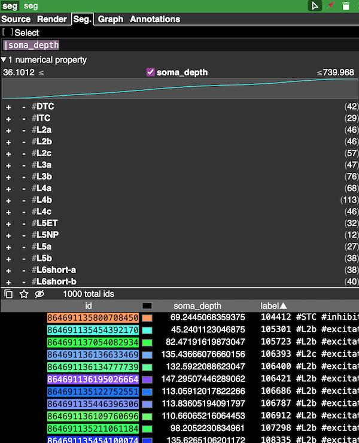

Segment properties are a method of organizing information about segment IDs in the current Google/Spelunker version of Neuroglancer.
Each segmentation layer can have at most one set of segment properties, expressed as an additional `source` for the layer.
The segment properties themselves are simply a JSON file following a [particular specification](https://github.com/google/neuroglancer/blob/master/src/datasource/precomputed/segment_properties.md), that allows you to associate labels, descriptions, tags, and numerical values with each segment ID.

## Basics

Segment properties consist of a list of segment IDs and a collection of properties for each ID in the list.
There are four types of properties that can be viewed in Neuroglancer:

* **Label**: A string that names each segment ID. Only one per ID per property list.
* **Description**: A longer description of each segment ID. Only one per ID per property list.
* **Tags**: A small collection of strings that can be used to filter segments. There can be more than one tag per ID.
* **Number**: Numeric properties (e.g. depth, synapse count) for each cell. There can be more than one numeric property provided.

In addition, the specification allows *string properties*, but these are not currently shown in Neuroglancer.

<figure markdown="span">
  { width="500" }
  <figcaption>Segment properties help make Neuroglancer more browsable from data</figcaption>
</figure>

## Building segment properties

The easiest way to work with segment properties is to build them from a dataframe.
The only absolute requirement is that the dataframe has a column associated with segment IDs.
For example, assume we have a pandas dataframe `df` with columns `segment_id`, `soma_depth`, and `cell_type` with some data in them.
We can use the `SegmentProperties.from_dataframe` method to build a `SegmentProperties` object from this dataframe.
In this case, we want `soma_depth` to be a numeric property and the values  `cell_type` to be a tag.

```python
import pandas as pd
from nglui.segmentprops import SegmentProperties

df = pd.DataFrame(
    {'segment_id': [1, 2, 3],
     'soma_depth': [100, 200, 300],
     'cell_type': ['pyramidal_cell', 'interneuron', 'interneuron']}
)

seg_prop = SegmentProperties.from_dataframe(
    df,
    id_col='segment_id',
    number_cols='soma_depth',
    tag_value_cols='cell_type'
)
```
 
To get a formatted segment proerties, you can use the `to_dict` method:

```python
seg_prop.to_dict()
```

which will produce something like:

```json
{'@type': 'neuroglancer_segment_properties',
 'inline': {'ids': ['1', '2', '3'],
  'properties': [{'id': 'tags',
    'type': 'tags',
    'tags': ['interneuron', 'pyramidal_cell'],
    'values': [[1], [0], [0]]},
   {'id': 'soma_depth',
    'type': 'number',
    'values': [100, 200, 300],
    'data_type': 'int32'}]}}
```

Note that multiple numeric properties can be passed a list of column names.

### Tag properties

There are two ways to associate tags with segment IDs.
When using the `tag_value_cols` argument, the unique values (except `None`) across all specified columns are used as tags.
Values that are duplicated across different columns will be counted as a single tag.
For tag value columns, the order is determined by the sorting of values.
By default, this is alphabetical, but it will follow the order from [categorical data](https://pandas.pydata.org/pandas-docs/stable/user_guide/categorical.html) in pandas.

If you need more fine control over the tags, you can use the `tag_bool_cols` argument.
Here, a column name or list of column names are passed with the expectation that each *column name* represents a tag and if the value of a given row is `True`, the tag is associated with the segment ID.
Here, the order will follow the order of the list.

Both `tag_value_cols` and `tag_bool_cols` can be used together, with the order being values followed by boolean columns.

You can also specify `tag_descriptions`, a dictionary where the tag names are the keys and longer-form descriptions are the values.
Any tag without a description will be passed through directly.

### Number properties

If you look at the JSON output above, you see that the `soma_depth` property has a field "data_type" that specifies the type of the numerical property, in this case `int32`.
Data type values are inferred from the column dtype and safe conversions are validated.

### Random number columns

Often, segment properties are used for very large lists of root ids.
If you want to sample just a few percent of these in Neuroglancer, it can be hard to get a small number of random ids without a lot of clicking.
Adding a numerical property that is just a random number between 0 and 1 will give you a way to load small subsets of the data using the filter tools.
You can add random columns when building a SegmentProperty object from a dataframe by setting the `random_columns` argument with the number of extra columns you want to add.
For example, to add a single random column:

```python
seg_prop = SegmentProperties.from_dataframe(
    df,
    id_col='segment_id',
    number_cols='soma_depth',
    random_columns=1,
)
```

Will add one random column as a numerical property with the default name `random_sample`.
Using numbers higher than 1 will add multiple random columns with names `random_sample_0`, `random_sample_1`, etc.
The name of the random column can be changed with the `random_column_prefix` argument.
Note that a value error will be raised if you try to add a random column with a name that already exists in the dataframe.

### Building segment properties manually

It is also possible to build segment properties manually with the `SegmentProperties` class.
Each type of property is represented by a different class: `LabelProperty`, `DescriptionProperty`, `TagProperty`, and `NumberProperty`.
Each property type has required and optional arguments that are used to build the property.
More details can be found in the [API reference](../reference/segmentprops.md).
You can then either build a SegmentProperties object from these properties, for example:

```python
from nglui.segmentprops import SegmentProperties, LabelProperty, NumberProperty

labels = LabelProperty(values=['cell_1', 'cell_2', 'cell_3'])
numbers = NumberProperty(
    id='hugeness',
    values=[1,2,3],
    data_type='float32',
)
props = SegmentProperties(
    ids = [1,2,3],
    label_property=labels,
    number_properties=numbers, # Could be a list of NumberProperty objects as well.
)
```

Note that validation happens on the `to_dict` method, so you can build invalid properties (such as different-length lists of ids and property values) without error.

## Saving segment properties

Segment properties must be hosted on a server to be used in Neuroglancer.
There are two main approaches to this:

#### 1. Use a CAVE state server endpoint to upload properties.

The CAVE state server has a special endpoint you can use to upload segment properties.
After initializing a `CAVEclient` object, you first upload the properties with the `upload_property_json` method and then build a link from the resulting id you get back.

```python
from caveclient import CAVEclient
client = CAVEclient('MY_DATASTACK')
ngl_url = "https://neuroglancer-demo.appspot.com"

prop_id = client.state.upload_property_json(seg_prop.to_dict())
prop_url = client.state.build_neuroglancer_url(prop_id, ngl_url=ngl_url, format_properties=True)
```

You will then use the resulting URL in the `source` field of a segmentation layer in Neuroglancer.

This approach is convenient, but there is a limit to how large the properties list can be.
In addition, you do not get to choose a readable URL for the properties and they must be behind CAVE authentication.

#### 2. Save the properties to a file web-accessible location.

For large properties or properties you want to be publicly accessible, you can save the properties to a file and host them on a web-accessible location with a particular organization.

First, save the properties to a file called `info` (no extensions!)

```python
import json

with open('info', 'w') as f:
    json.dump(props.to_dict(), f) 
```

Next, create a directory in a web-accessible location (e.g. `https://my-server/my-property`) or public cloud bucket (e.g. `gs://my-bucket/my-property`) and upload the `info` file to that directory.

The URL you will use to load the properties into Neuroglancer will be `precomputed://` followed by the URL of the directory or bucket (e.g. `precomputed://https://my-server/my-property` or `precomputed://gs://my-bucket/my-property`).

#### Adding segment properties to Neuroglancer

If saved segment properties with either of the two methods above, you will get a URL that you can load into Neuroglancer as a source for a segmentation layer.
If you want to do this manually in a browser you have already have open, select the segmentation layer, go to the source tab, and click the `+` button to add a new source and paste the URL in.


## Segment properties in StateBuilder.

The `StateBuilder` class lets you set either static segment properties or segment properties that are generated from a dataframe.
See the [StateBuilder documentation](../usage/statebuilder.md#segment-properties) for more details.